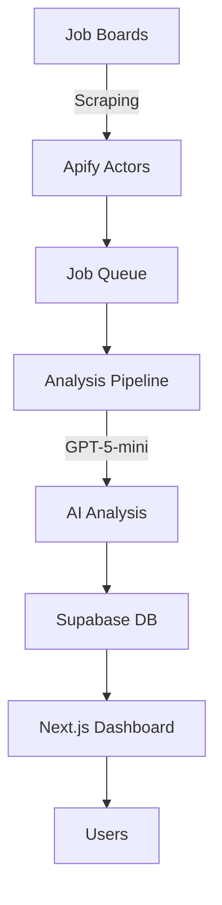

# 🏗️ Sales Tool Detector - Technical Architecture

## 📐 System Overview

Sales Tool Detector is built on a modern, scalable architecture using Next.js 14, Supabase, and OpenAI GPT-5-mini. The system processes job postings to identify companies using specific sales tools.



---

## 🎯 Core Architecture Principles

1. **Separation of Concerns**: Clear boundaries between data, logic, and presentation
2. **Scalability**: Designed to handle 100,000+ jobs per month
3. **Cost Optimization**: Pre-filtering and caching to minimize API costs
4. **Fault Tolerance**: Queue-based processing with retry logic
5. **Real-time Updates**: Live dashboard with WebSocket support (future)

---

## 🗄️ Database Schema

### Primary Tables

```sql
-- 1. companies (main entity)
CREATE TABLE companies (
  id UUID PRIMARY KEY,
  name TEXT NOT NULL,
  normalized_name TEXT UNIQUE,
  uses_outreach BOOLEAN,
  uses_salesloft BOOLEAN,
  uses_both BOOLEAN,
  signal_type TEXT,
  context TEXT,
  detection_confidence TEXT,
  created_at TIMESTAMPTZ DEFAULT NOW()
);

-- 2. job_queue (processing pipeline)
CREATE TABLE job_queue (
  id UUID PRIMARY KEY,
  job_type TEXT, -- 'scrape' | 'analyze'
  status TEXT, -- 'pending' | 'processing' | 'completed' | 'failed'
  payload JSONB,
  created_at TIMESTAMPTZ,
  completed_at TIMESTAMPTZ
);

-- 3. search_terms (configuration)
CREATE TABLE search_terms (
  id UUID PRIMARY KEY,
  search_term TEXT UNIQUE,
  is_active BOOLEAN DEFAULT true,
  last_scraped_date TIMESTAMPTZ,
  jobs_found_count INTEGER
);
```

### Key Indexes
- `companies.normalized_name` - Unique constraint for deduplication
- `job_queue.status` - Fast queue filtering
- `companies.created_at` - Time-based queries

---

## 🔄 Data Flow Architecture

### 1. **Scraping Pipeline**
```
Search Terms → Apify Actors → Raw Jobs → Job Queue
```

### 2. **Analysis Pipeline**
```
Job Queue → Pre-filtering → GPT-5-mini → Confidence Scoring → Database
```

### 3. **Export Pipeline**
```
Database → Filtering → Transformation → CSV/JSON → Download
```

---

## 📁 Project Structure

```
sales-tool-detector/
├── app/                        # Next.js App Router
│   ├── api/                   # API endpoints
│   │   ├── dashboard/        # Dashboard stats
│   │   ├── export/          # Export functionality
│   │   ├── scrape/          # Scraping triggers
│   │   └── analyze/         # Analysis triggers
│   ├── companies/            # Companies page
│   └── page.tsx             # Main dashboard
│
├── components/                # React components
│   ├── companies/           # Company-related components
│   │   ├── companies-table.tsx
│   │   └── companies-table-wrapper.tsx
│   ├── dashboard/           # Dashboard components
│   │   ├── stats-cards.tsx
│   │   └── recent-discoveries.tsx
│   └── ui/                  # shadcn/ui components
│
├── lib/                      # Core libraries
│   ├── services/            # Business logic
│   │   ├── dataService.ts  # Database operations
│   │   ├── scraperService.ts # Scraping logic
│   │   └── analysisService.ts # AI analysis
│   ├── supabase.ts         # Database client
│   └── database.types.ts   # TypeScript types
│
├── migrations/              # Database migrations
│   ├── supabase-ready-schema.sql
│   └── import-schema-updates.sql
│
├── scripts/                # Utility scripts
│   ├── import-google-sheets-data.js
│   └── import-remaining-companies.js
│
└── public/                # Static assets
```

---

## 🔧 Technology Stack Details

### Frontend Stack
- **Next.js 14**: App Router for server components
- **TypeScript**: Type safety and better DX
- **Tailwind CSS**: Utility-first styling
- **shadcn/ui**: Pre-built components
- **date-fns**: Date formatting

### Backend Stack
- **Next.js API Routes**: Serverless functions
- **Supabase**: PostgreSQL + Auth + Realtime
- **OpenAI API**: GPT-5-mini for analysis
- **Apify**: Web scraping infrastructure

### Infrastructure
- **Vercel**: Edge deployment
- **GitHub**: Version control
- **npm**: Package management

---

## 🤖 AI Analysis Architecture

### GPT-5-mini Configuration
```typescript
const ANALYSIS_CONFIG = {
  model: "gpt-5-mini-2025-08-07", // NEVER use GPT-4
  temperature: 0.3,
  max_tokens: 200,
  system_prompt: "Detect sales tools with high precision"
};
```

### Detection Logic
1. **Pattern Matching**: Exact tool names
2. **Context Analysis**: Usage context validation
3. **Confidence Scoring**: High/Medium/Low
4. **False Positive Filter**: Generic term exclusion

---

## 🔐 Security Architecture

### Environment Variables
```env
# Critical: Never expose these
SUPABASE_SERVICE_ROLE_KEY
OPENAI_API_KEY
APIFY_TOKEN

# Public: Safe to expose
NEXT_PUBLIC_SUPABASE_URL
NEXT_PUBLIC_SUPABASE_ANON_KEY
```

### Security Measures
- Row-level security (RLS) on database
- API rate limiting
- Input validation
- SQL injection prevention
- XSS protection

---

## ⚡ Performance Optimizations

### Database
- Indexed columns for fast queries
- Materialized views for aggregations
- Connection pooling
- Query optimization

### Frontend
- Server-side rendering (SSR)
- Static generation where possible
- Image optimization
- Code splitting
- Lazy loading

### API
- Response caching (15 minutes)
- Batch processing
- Queue-based architecture
- Retry mechanisms

---

## 📊 Scalability Considerations

### Current Capacity
- **Database**: 10GB storage, 100 concurrent connections
- **Processing**: 1,000 jobs/hour
- **Users**: 100 concurrent users
- **Export**: 10,000 records in < 5 seconds

### Scaling Strategy
1. **Horizontal Scaling**: Multiple worker instances
2. **Database Sharding**: Partition by company/date
3. **Caching Layer**: Redis for hot data
4. **CDN**: Static asset delivery
5. **Queue Scaling**: Multiple processing workers

---

## 🔄 State Management

### Server State
- Supabase for persistent data
- Next.js cache for temporary data
- URL parameters for filters

### Client State
- React hooks for UI state
- URL state for navigation
- Local storage for preferences

---

## 🚦 Error Handling

### Strategy
```typescript
try {
  // Operation
} catch (error) {
  // 1. Log error
  console.error('Operation failed:', error);
  
  // 2. Notify monitoring
  await notifyMonitoring(error);
  
  // 3. Fallback behavior
  return fallbackResponse;
  
  // 4. User feedback
  toast.error('Operation failed');
}
```

### Error Types
- **Scraping Errors**: Retry with backoff
- **API Errors**: Fallback to cache
- **Database Errors**: Transaction rollback
- **Analysis Errors**: Queue for retry

---

## 📈 Monitoring & Observability

### Metrics
- API response times
- Database query performance
- Scraping success rates
- Analysis accuracy
- Cost per operation

### Logging
- Structured logging (JSON)
- Log levels (ERROR, WARN, INFO, DEBUG)
- Centralized log aggregation
- Real-time error tracking

---

## 🔮 Future Architecture Enhancements

### Near Term
- WebSocket for real-time updates
- Redis caching layer
- Background job processing
- Webhook system

### Long Term
- Microservices architecture
- Kubernetes deployment
- GraphQL API
- Machine learning pipeline
- Multi-tenant support

---

## 🛠️ Development Workflow

### Local Development
```bash
npm run dev        # Start development server
npm run build     # Build for production
npm run test      # Run tests
npm run lint      # Lint code
```

### Deployment Pipeline
1. Push to GitHub
2. Vercel auto-deploy
3. Run migrations
4. Smoke tests
5. Monitor metrics

---

## 📝 API Documentation

### Endpoints

#### GET /api/dashboard/stats
Returns dashboard statistics

#### GET /api/export
Exports companies as CSV/JSON

#### POST /api/scrape
Triggers scraping job

#### POST /api/analyze
Triggers analysis job

---

## 🔗 External Integrations

### Current
- Apify (scraping)
- OpenAI (analysis)
- Supabase (database)

### Planned
- Slack (notifications)
- Salesforce (CRM sync)
- HubSpot (CRM sync)
- Zapier (automation)

---

**Last Updated**: August 26, 2025
**Version**: 1.0.0
**Architecture Review**: Approved